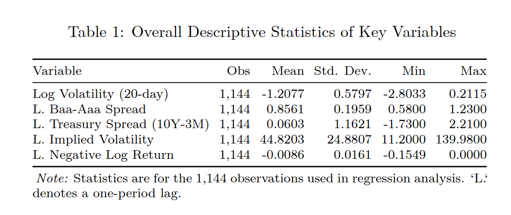
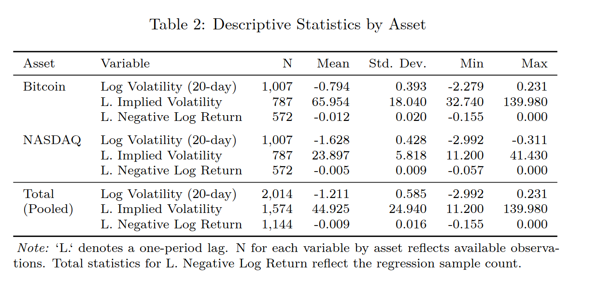
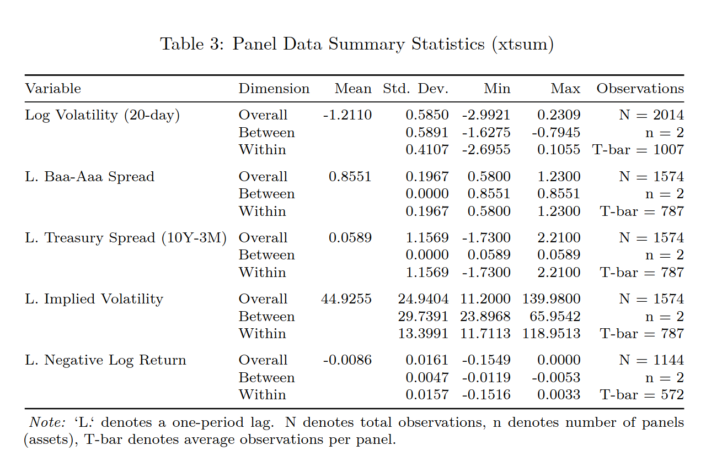
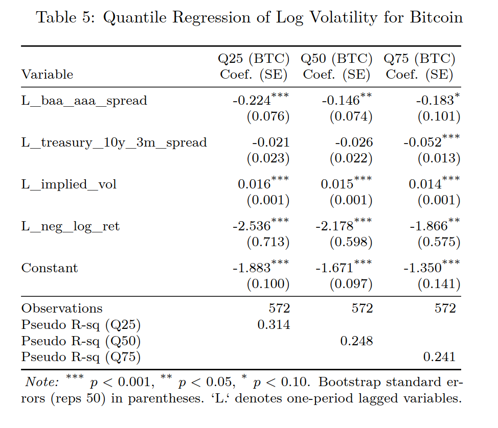
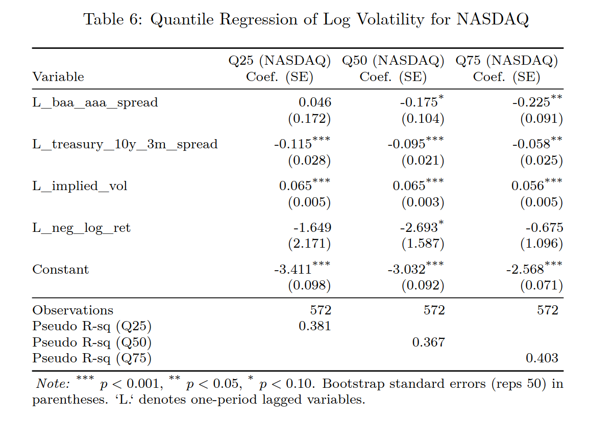
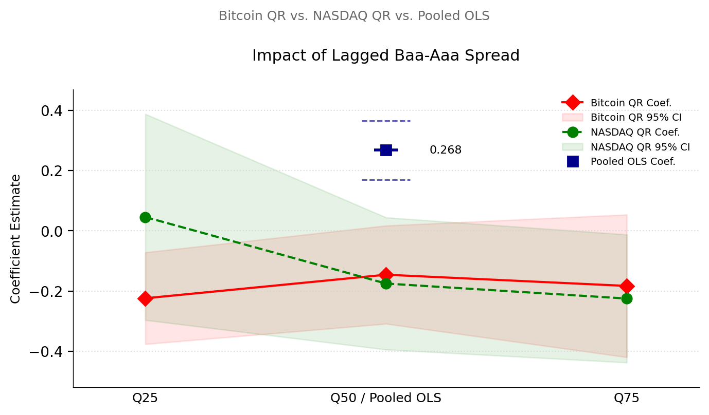
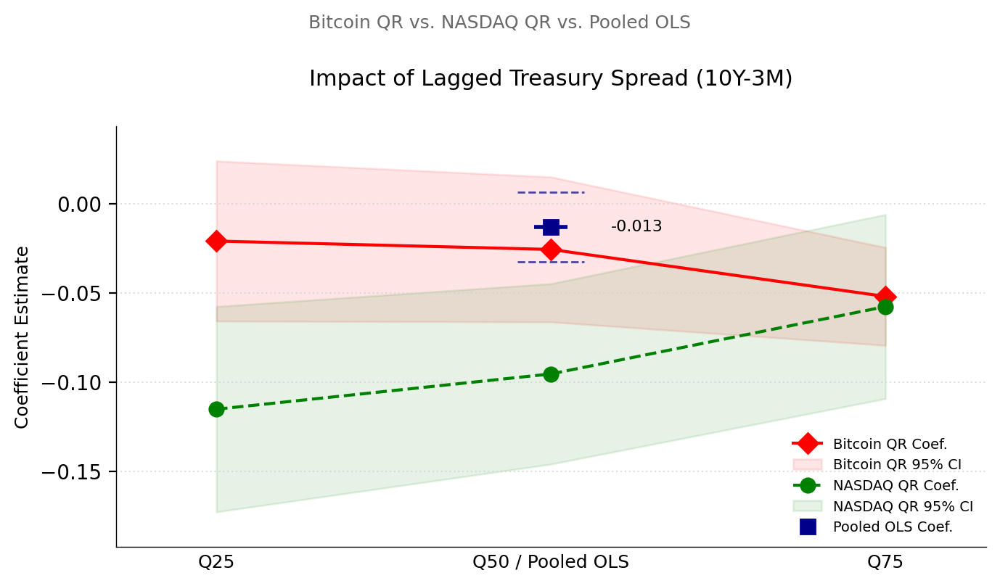
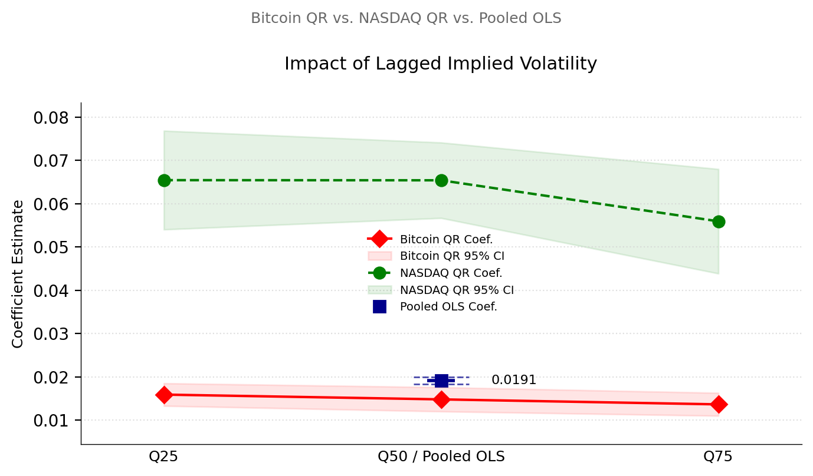
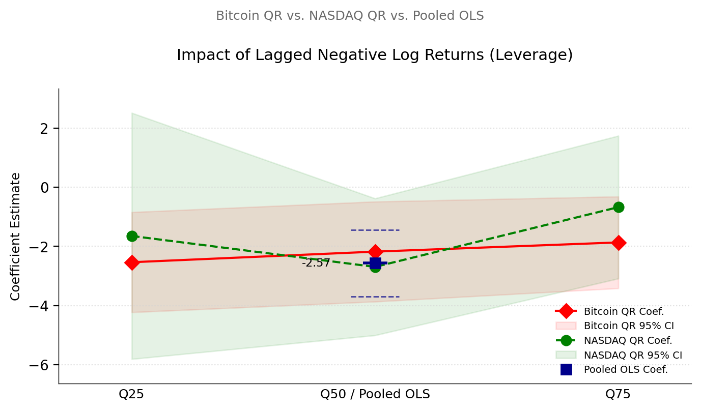

# The Impact of Credit Market Stress on Asset Volatility: A Quantile Regression Approach for Bitcoin and NASDAQ

## Project Overview

This repository contains the code and data (where publicly available) for a research study investigating how credit market stress impacts the volatility of both digital assets (Bitcoin) and traditional financial assets (NASDAQ). The study employs a panel framework with daily data and utilizes quantile regression to explore nuanced, heterogeneous impacts across different volatility regimes.

## Motivation

The complex, jump-prone dynamics of asset return volatility are critical for risk management, asset pricing, and forecasting, often challenging traditional models and highlighting the importance of understanding sudden volatility changes. This study draws inspiration from Caporin, Rossi, and Santucci de Magistris (2016), who demonstrated with their HAR-Volatility-Jump model that credit risk indicators can predict volatility jumps identified using high-frequency data. This paper investigates how credit market stress, proxied by the BAA-AAA corporate bond spread, impacts the volatility of both a digital asset (Bitcoin) and a traditional one (NASDAQ). We hypothesize that higher credit spreads increase subsequent asset volatility (Ha: beta1 > 0), and further, that Bitcoin exhibits greater sensitivity to such stress than NASDAQ.

## Data

This study uses daily data (March 23, 2021 April 9, 2025) for Bitcoin (BTC) prices (sourced from Yahoo Finance) and its DVOL implied volatility index (from Deribit), alongside NASDAQ Composite Index prices (Yahoo Finance) and its VXN implied volatility index (from FRED). FRED also provided data for the Baa-Aaa credit spread and the 10-year Treasury minus 3-month Treasury bill spread. After data cleaning, necessary transformations (including log return and volatility calculations), lagging of independent variables, and listwise deletion to ensure a complete dataset for regression, the final panel dataset available for the core analysis consists of 1,144 daily observations.

### Descriptive Statistics

Overall descriptive statistics of key variables used in the regression analysis:


Descriptive statistics by individual asset, highlighting notable distinctions:


Panel data summary statistics, revealing inherent differences in average volatility levels and variability of factors:


## Methodology

This study uses a panel data approach with daily observations for Bitcoin and NASDAQ (March 23, 2021 April 9, 2025) to examine how credit market stress and other factors impact 20-day log volatility (logvol_20d). To mitigate potential endogeneity and model the influence of prior conditions, all explanatory variables are lagged by one day.

1.  **Dependent Variable:** The dependent variable, log volatility (logvol_20d), measures recent realized volatility for both Bitcoin and NASDAQ. Inspired by the methodology of Caporin, Rossi, and Santucci de Magistris [1], it is calculated as the natural logarithm of the 20-day rolling standard deviation of daily log returns, which is then annualized by multiplying by the square root of 252.
2.  **Independent Variables (one-day lagged):**
    * `L_baa_aaa_spread`: Representing the lagged Baa-Aaa corporate bond yield spread, which serves as a proxy for credit market stress.
    * `L_treasury_10y_3m_spread`: The lagged difference between 10-year Treasury and 3-month Treasury bill rates, reflecting the yield curve slope.
    * `L_implied_vol`: Which is the lagged implied volatility (DVOL_BTC for Bitcoin, VXN for NASDAQ), capturing asset-specific market expectations of future fluctuations.
    * `L_neg_log_ret`: Representing lagged negative daily log returns, included to account for the leverage effect where negative returns often precede higher volatility.

**Econometric Models:**

* **Baseline Model: Pooled Ordinary Least Squares (OLS):** While initially considering fixed-effects, diagnostic tests on the panel data guided the selection of Pooled Ordinary Least Squares (OLS) as the more statistically appropriate baseline estimator. Both the Breusch-Pagan LM test (Prob > chibar2 = 1.0000, favoring Pooled OLS over Random Effects) and an F-test for fixed effects (Prob > F = 0.2002) suggested that distinct, time-invariant asset-specific effects were not dominant after controlling for the included regressors.
    

* **Primary Innovation: Asset-Specific Quantile Regression:** To explore complex, heterogeneous impacts of explanatory factors on log volatility beyond the average effects captured by OLS, this study employs quantile regression as its innovative analytical step. This approach allows modeling how predictors affect different parts (quantiles) of the conditional log volatility distribution, estimated separately for Bitcoin and NASDAQ using simultaneous quantile regression for the 25th, 50th (median), and 75th percentiles of conditional log volatility. This nonlinear approach, extending traditional Ordinary Least Squares (OLS) analysis, seeks a more nuanced understanding of risk transmission and volatility dynamics in diverse financial markets.
    * **Bitcoin Quantile Regression Results:**
        
    * **NASDAQ Quantile Regression Results:**
        

## Key Findings (Visualized)

Asset-specific quantile regressions reveal that the impacts of financial indicators on volatility are frequently not uniform, as suggested by Pooled OLS. Instead, these effects often vary significantly between Bitcoin and NASDAQ and across their respective low, medium, and high volatility states.

* **Impact of Lagged Baa-Aaa Spread:** Asset-specific quantile effects of the lagged Baa-Aaa spread differ markedly from the positive and significant Pooled OLS estimate. For Bitcoin, an increase in this credit spread is linked to a statistically significant decrease in subsequent log volatility across all its examined quantiles (25th, 50th, and 75th). For NASDAQ, the impact of the credit spread is not statistically significant at its lower (25th) quantile; however, at its median (50th) and upper (75th) quantiles, an increased credit spread is associated with significantly lower subsequent log volatility. Thus, where significant, the asset-specific quantile effects of credit stress primarily suggest a volatility-dampening role for both assets, contrasting with the average positive impact found by Pooled OLS.
    

* **Impact of Lagged Treasury Spread (10Y-3M):** The lagged Treasury spread, found insignificant in the Pooled OLS model, reveals significant relationships in the asset-specific quantile analysis. For Bitcoin, a steeper yield curve significantly lowers subsequent volatility, but only when Bitcoin is already in a high volatility state (75th quantile). Conversely, for NASDAQ, a steeper yield curve is consistently associated with significantly lower future volatility across all quantiles, with the most pronounced dampening effect in its lower volatility states.
    

* **Impact of Lagged Implied Volatility:** As shown in Figure 3, lagged implied volatility is a consistently positive and highly significant predictor of future log volatility for both Bitcoin and NASDAQ across all examined quantiles. While this effect is remarkably stable for Bitcoin, its magnitude is substantially larger for NASDAQ.
    

* **Impact of Lagged Negative Log Returns (Leverage Effect):** The leverage effect, proxied by L_neg_log_ret, also demonstrates asset-specific patterns. For Bitcoin, past negative returns significantly increase subsequent volatility across all its quantiles, with the effect's magnitude slightly decreasing at higher volatility states. For NASDAQ, this effect is statistically significant primarily at its median (50th) volatility quantile, with less certainty at its distribution's tails.
    

## Repository Structure
```text
credit-market-volatility-research/
├── README.md               
├── paper/
│   └── FINAL.pdf       # The final research paper
├── data/
│   └── bitcoin_dataset_clean.csv # Cleaned and processed dataset 
├── code/
│   ├── stata/
│   │   ├── 01_data_prep_and_regressions.do # Stata script for data prep, diagnostics, OLS & QR
│   │   └── 02_generate_tables.do           # Stata script for generating LaTeX tables
│   └── python/
│       └── generate_plots.py             # Python script for generating coefficient plots
├── output/
│   ├── tables/             # Generated LaTeX tables (e.g., descriptive stats, regressions) and their PNG images
│   └── figures/            # Generated PNG and PDF plots
```
## How to Reproduce the Analysis

To reproduce the results and figures in this study:

### Prerequisites

* **Stata:** Required for running the econometric models and generating tables.
* **Python 3.x:** Required for generating the plots.
    * Install necessary Python libraries: `pip install pandas numpy matplotlib`

### Steps

1.  **Clone the repository:**
    ```bash
    git clone [https://github.com/lrud/credit-market-volatility-research.git](https://github.com/lrud/credit-market-volatility-research.git)
    cd credit-market-volatility-research
    ```
2.  **Obtain Data:**
    * If not, you will need to source daily Bitcoin and NASDAQ prices (Yahoo Finance), DVOL (Deribit), VXN, Baa-Aaa spread, and 10Y-3M Treasury spread (FRED) for the period March 23, 2021 - April 9, 2025, and save them as `bitcoin_dataset_clean.csv` in the `data/` directory.
3.  **Run Stata Scripts:**
    * Open Stata.
    * Navigate to the `code/stata/` directory.
    * Run `01_data_prep_and_regressions.do` first to prepare the data and run the core regressions.
    * Then, run `02_generate_tables.do` to generate the descriptive statistics and regression tables in LaTeX format, which will be saved in `output/tables/` (alongside the PNG images you created).
4.  **Run Python Plotting Script:**
    * Navigate to the `code/python/` directory in your terminal.
    * Run the script: `python generate_plots.py`
    * This will generate the coefficient plots (PNG and PDF formats) and save them in `output/figures/`.


## References

[1] Caporin, M., Rossi, E., & Santucci de Magistris, P. (2016). Volatility jumps and their economic determinants. Journal of Financial Econometrics, 14(1), 29-80. DOI: 10.1093/jjfinec/nbu028.